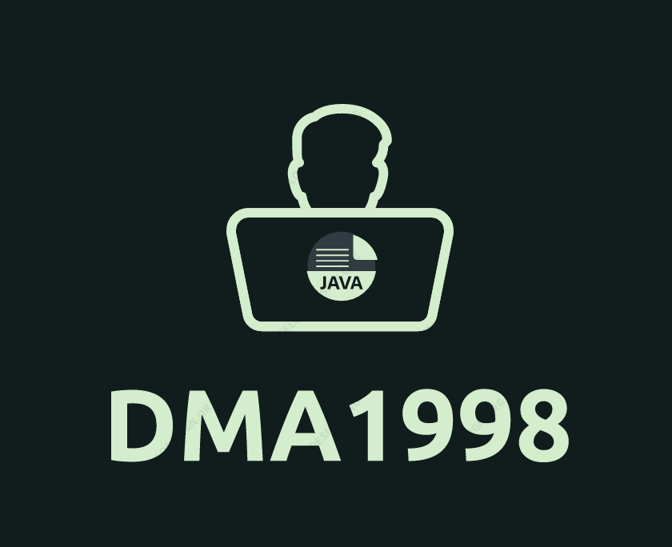

<div id="top"></div>
<!--
*** Thanks for checking out the Best-README-Template. If you have a suggestion
*** that would make this better, please fork the repo and create a pull request
*** or simply open an issue with the tag "enhancement".
*** Don't forget to give the project a star!
*** Thanks again! Now go create something AMAZING! :D
-->


<!-- PROJECT SHIELDS -->
<!--
*** I'm using markdown "reference style" links for readability.
*** Reference links are enclosed in brackets [ ] instead of parentheses ( ).
*** See the bottom of this document for the declaration of the reference variables
*** for contributors-url, forks-url, etc. This is an optional, concise syntax you may use.
*** https://www.markdownguide.org/basic-syntax/#reference-style-links
-->
<!-- ABOUT THE PROJECT -->
<!-- PROJECT LOGO -->
<br />
<div align="center">
  <a href="https://github.com/othneildrew/Best-README-Template">
    
  </a>
   </div>
   
## About The Project


This is bookstore web java application written in Java based on Spring Boot with the ability to register with an email sender to confirm the token, authorization, validation and many other functionalities.

### Technologies/libraries
* [Java 11](https://www.oracle.com/java/technologies/javase/jdk11-archive-downloads.html)
* [Spring Framework (Spring Boot, MVC, JPA, Security)](https://spring.io/projects)
* [Hibernate](https://hibernate.org/orm/)
* [Jackson](https://github.com/FasterXML/jackson)
* [Lombok](https://projectlombok.org/)
* [Thymeleaf](https://www.thymeleaf.org/)
* [SonarQube](https://www.sonarqube.org/)
* [JUnit](https://junit.org/junit4/javadoc/latest/)
* [JQuery](https://jquery.com)

### Database
[MySQL](https://www.mysql.com/)

### Build automation tool
[Maven](https://maven.apache.org/)

## Getting Started

### Prerequisites

For running the application make sure components bellow installed on your local machine

* Java 11
* Maven 3.6.0+
* MySQL 8.0

### Installation

1. Clone the repo:
   ```sh
   git clone https://github.com/DMA1998/bookstore-2022.git
   ```
2. Set up datasource url:
   ```sh
   jdbc:mysql://localhost:3306/bookstore
   ```
3. Build application:
   ```sh
   mvn clean install -DskipTests=true
   ```

<!-- CONTACT -->
## Contact

Dmytro - [LinkedIn](https://www.linkedin.com/in/dmitriy-mykh/)

Project Link: [GitHub](https://github.com/DMA1998/bookstore-2022)
